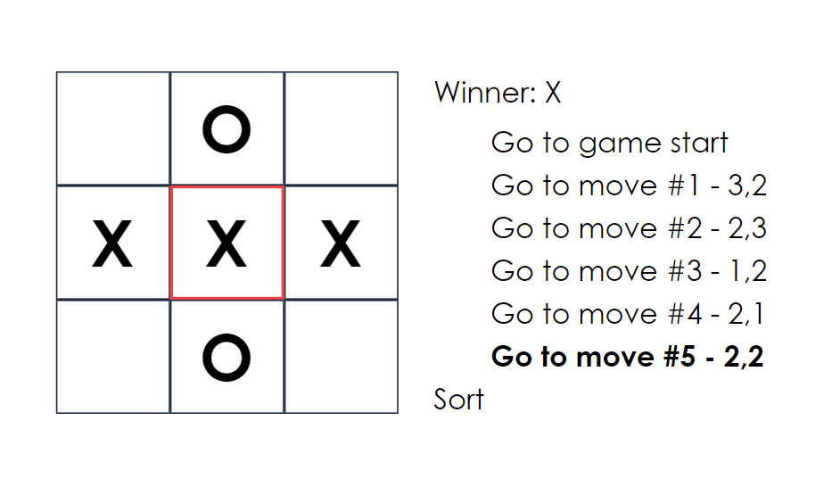

# React Tic-Tac-Toe

## Table of contents

- [Overview](#overview)
  - [The challenge](#the-challenge)
  - [Screenshot](#screenshot)
- [My process](#my-process)
  - [Built with](#built-with)
  - [What I learned](#what-i-learned)
  - [Useful resources](#useful-resources)
- [Author](#author)

## Overview

### The challenge

In addition to playing regular tic-tac-toe, I implemented the following extra features:

- Display the location for each move in the format (col, row) in the move history list.
- Bold the currently selected item in the move list.
- Rewrite Board to use two loops to make the squares instead of hardcoding them.
- Add a toggle button that lets you sort the moves in either ascending or descending order.
- When someone wins, highlight the three squares that caused the win.
- When no one wins, display a message about the result being a draw.

### Screenshot

## My process

### Built with

- [React](https://reactjs.org/) - JS library
- [TypeScript](https://www.typescriptlang.org/) - JS Superset
- [Tailwind CSS](https://tailwindcss.com/) - Styles

### What I learned

I learned a lot about convert class components to functional components, managing state history, and using utility classes for calculations

### Useful resources

- [Tutorial: Intro to React](https://reactjs.org/tutorial/tutorial.html#before-we-start-the-tutorial) - Tutorial on building Tic-Tac-Toe in React

## Author

- Website - [Justin Fowler Art](https://www.justinfowlerart.com)